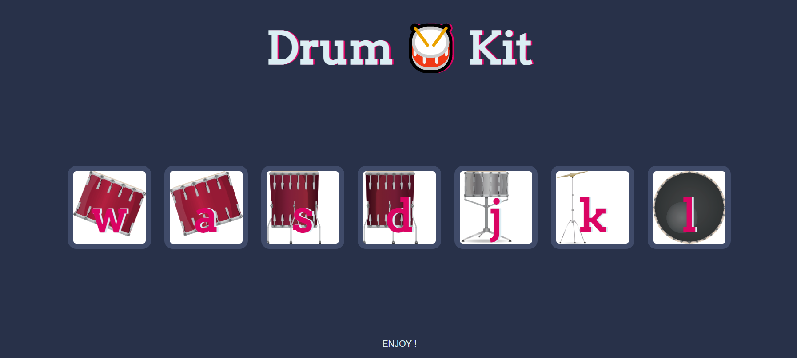

#Web Development - Drum Kit Player  

User's can use this player as a digital drum kit.

## Table of contents

- [Overview](#overview)
  - [The challenge](#the-challenge)
  - [Screenshot](#screenshot)
  - [Links](#links)
- [My process](#my-process)
  - [Built with](#built-with)
  - [What I learned](#what-i-learned)
  - [Continued development](#continued-development)
- [Author](#author)

## Overview
Hello Everyone! I'm learning DOM/JavaScript. This assignment given me by Dr.Angela YU.
### The challenge

The challenge aims to share an online basic drum kit.

### Screenshot


### Links

https://bekirkutluhan.github.io/DrumKit-Challenge/

## My process

My first goal was learning how to manipulate html objects by using DOM.
Afterwards i applied methods that i learned.

### Built with

- Semantic HTML5 markup
- CSS
- DOM

### What I learned

This challenge is super educational for DOM.

To see how you can add code snippets, see below:

```html
<!-- COL-CIRCLE -->
<div class="col-lg-4 ">
  <i class="fas fa-bullseye  color-red fa-4x"></i><br>
  <h3 class="Mont">Elite Clientele</h3>
  <p id="paragraphs1">We have all the dogs, the <br>greatest dogs.</p>
</div>
 ```
  ```CSS
  .drum {
    outline: none;
    border: 10px solid #404B69;
    font-size: 5rem;
    font-family: 'Arvo', cursive;
    line-height: 2;
    font-weight: 900;
    color: #DA0463;
    text-shadow: 3px 0 #DBEDF3;
    border-radius: 15px;
    display: inline-block;
    width: 150px;
    height: 150px;
    text-align: center;
    margin: 10px;
    background-color: white;
  }

```
```JS
for (var i = 0; i < document.querySelectorAll(".drum").length; i++) {
  document.querySelectorAll(".drum")[i].addEventListener("click", function() {
  var buttonClicked=event.target.innerHTML;
  console.log(buttonClicked);
  switch (buttonClicked) {
    case "w":
      var tom1 = new Audio("sounds/tom-1.mp3");
      tom1.play();
    document.querySelectorAll(".drum")[0].classList.add("pressed");
      setTimeout(function() {document.querySelectorAll(".drum")[0].classList.remove("pressed")},200);
      break;

```

###  - Continued development

I still need to learn a lot. Please contact me if you think i did something wrong or weak or mine is worse than yours.

## Bekir Kutluhan COŞKUN

-My Linkedin-https://www.linkedin.com/in/bekir-kutluhan-co%C5%9Fkun-6b63b8146/
- Frontend Mentor- https://www.frontendmentor.io/profile/BekirKutluhan
